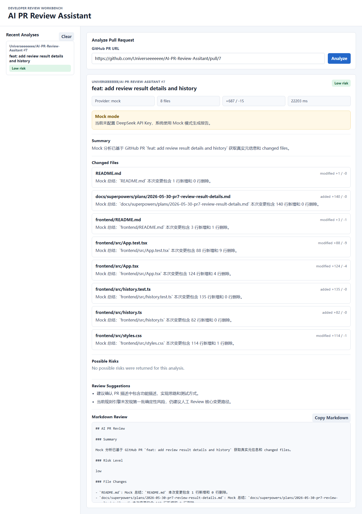

# AI PR Review Assistant

AI PR Review Assistant 是一个面向开发者的 Web 工具。用户输入 GitHub Pull Request 链接后，系统会获取 PR 基本信息、changed files 和 patch diff，并通过规则引擎与 AI Provider 混合分析，生成 PR 总结、可能风险、Review 建议和可复制的 Markdown Review。

第一版定位是辅助人工 Review，而不是替代人工结论。页面和报告会使用“可能风险”“建议确认”“建议补充测试”等措辞，帮助 Reviewer 更快聚焦需要关注的变更。



Detailed architecture and design notes are available in [docs/design.md](docs/design.md).

## Core Features

- 输入公开 GitHub PR 链接并分析变更。
- 基于 diff 和文件路径执行规则风险扫描。
- 展示 PR 概览、总体风险级别、PR 总结、文件摘要、可能风险和 Review 建议。
- 支持可复制 Markdown Review。
- 支持 DeepSeek 真实模型分析。
- 未配置 DeepSeek API Key 时自动进入 Mock 模式，保证本地演示稳定。
- 支持可选 GitHub Token，提高公开 GitHub API 访问限额。
- 最近分析记录保存在浏览器 localStorage。

## Tech Stack

```text
frontend: React + Vite + TypeScript
backend:  FastAPI
api:      GitHub REST API
ai:       DeepSeekProvider / MockProvider
storage:  browser localStorage
```

## Architecture

```text
frontend/
  React + Vite + TypeScript
  - PR URL input
  - result display
  - risk level display
  - Markdown Review copy
  - recent analyses in localStorage

backend/
  FastAPI
  - /api/analyze-pr

  app/
    main.py
    config.py
    schemas.py
    services/
      github_client.py
      rule_engine.py
      ai_provider.py
      report_composer.py
```

Target first-version backend flow:

```text
POST /api/analyze-pr
  -> parse GitHub PR URL
  -> fetch PR metadata
  -> fetch changed files + patch diff
  -> truncate oversized diffs
  -> run Rule Engine
  -> run AI Provider
  -> compose stable ReviewResult JSON + Markdown
  -> return to frontend
```

Current status:

```text
PR 1: project skeleton, README draft, frontend shell, backend health check.
PR 2: Mock /api/analyze-pr endpoint and shared response schemas.
PR 3: GitHub PR metadata and changed files fetching before Mock analysis.
PR 4: Rule Engine scans changed files and patch diff for deterministic risks.
PR 5: pluggable AI Provider layer with Mock / DeepSeek switching and fallback.
PR 6: frontend workbench submits PR URLs to the backend and renders basic status, warning, and error states.
PR 7: frontend renders detailed results, supports Markdown Review copy, and stores recent analyses in localStorage.
```

## Recommended Review Path

1. Follow Quick Start to run the backend and frontend locally.
2. Keep `AI_PROVIDER=auto` and leave `DEEPSEEK_API_KEY` empty for Mock mode, or configure DeepSeek for real model output.
3. Open `http://localhost:5173`.
4. Analyze a public GitHub PR URL, for example:

```text
https://github.com/Universeeeeeee/AI-PR-Review-Assitant/pull/7
```

5. Review PR metadata, summary, possible risks, warnings, suggestions, and Markdown Review output.
6. Use `Copy Markdown` to copy the generated review text.

## Quick Start

### 1. Start Backend

PowerShell:

```powershell
cd backend
python -m venv .venv
.\.venv\Scripts\Activate.ps1
pip install -r requirements.txt
Copy-Item .env.example .env
uvicorn app.main:app --reload
```

macOS / Linux:

```bash
cd backend
python -m venv .venv
source .venv/bin/activate
pip install -r requirements.txt
cp .env.example .env
uvicorn app.main:app --reload
```

### 2. Start Frontend

```bash
cd frontend
npm install
cp .env.example .env
npm run dev
```

### 3. Open App

```text
http://localhost:5173
```

## Environment Variables

Copy `backend/.env.example` to `backend/.env` for local development.

```env
AI_PROVIDER=auto
DEEPSEEK_API_KEY=
DEEPSEEK_BASE_URL=https://api.deepseek.com
DEEPSEEK_MODEL=deepseek-v4-flash
GITHUB_TOKEN=
MAX_FILES=20
MAX_PATCH_CHARS=30000
REQUEST_TIMEOUT=60
AI_TIMEOUT_SECONDS=30
CORS_ORIGINS=http://localhost:5173,http://127.0.0.1:5173
```

The frontend can optionally configure the backend base URL:

```env
VITE_API_BASE_URL=http://localhost:8000
```

Do not commit real `.env` files, API keys, or GitHub tokens. `.gitignore` is configured to keep local secret files out of Git while allowing `.env.example` templates.

DeepSeek API compatibility is documented in the official DeepSeek API docs: [Your First API Call](https://api-docs.deepseek.com/) and [Models](https://api-docs.deepseek.com/api/list-models).

## API Contract

`POST /api/analyze-pr`

Request:

```json
{
  "prUrl": "https://github.com/owner/repo/pull/123"
}
```

Successful response:

```text
pr        GitHub PR metadata
analysis  summary, riskLevel, truncated, fileSummaries, risks, suggestions, markdownReview
meta      provider, mock, analyzedAt, durationMs, warnings
```

Error response:

```json
{
  "detail": {
    "code": "INVALID_PR_URL",
    "message": "请输入有效的 GitHub Pull Request URL。"
  }
}
```

Error code mapping:

```text
INVALID_PR_URL        400
GITHUB_NOT_FOUND      404
GITHUB_RATE_LIMITED   429
GITHUB_API_ERROR      502
AI_PROVIDER_ERROR     502
```

## Mock Mode

Default mode:

```text
AI_PROVIDER=auto
```

Behavior:

- `AI_PROVIDER=auto` without `DEEPSEEK_API_KEY` uses `MockProvider`.
- `AI_PROVIDER=auto` with `DEEPSEEK_API_KEY` uses `DeepSeekProvider`.
- `AI_PROVIDER=mock` always uses `MockProvider`.
- `AI_PROVIDER=deepseek` requires `DEEPSEEK_API_KEY`; missing key or provider errors return `AI_PROVIDER_ERROR`.
- In auto mode, DeepSeek timeout, API error, or invalid JSON falls back to Mock mode and adds a warning.
- Mock and DeepSeek modes both preserve deterministic Rule Engine results in `analysis.risks`.

## Rule Engine

The current Rule Engine scans changed file paths and patch diff lines. It does not perform AST or cross-file semantic analysis.

First batch rules:

```text
security: hardcoded-secret, unsafe-html, unsafe-eval, sql-string-concat
stability: removed-error-handling, removed-null-check, config-change, large-change
tests: missing-tests, removed-tests
maintainability: complex-condition, unclear-todo-fixme
```

Rule results are review hints, not absolute bug claims. Reports should use wording such as “可能风险” and “建议确认”.

The frontend must show:

```text
当前未配置 DeepSeek API Key，系统使用 Mock 模式生成报告。
```

When auto fallback happens, the frontend should also show warning codes such as `AI_TIMEOUT`, `AI_PROVIDER_ERROR`, or `AI_INVALID_JSON`.

## Verification

Backend:

```powershell
cd backend
.\.venv\Scripts\python.exe -m pytest -q
```

Frontend:

```powershell
cd frontend
npm test -- --run
npm run build
```

## Current Limits

- 当前版本主要支持公开 GitHub PR。
- 不支持私有仓库 PR 的完整权限流程。
- 不抓取完整仓库内容，仅分析 PR changed files 和 patch diff。
- 不做 AST 级语义分析。
- 不做跨文件调用链分析。
- 不做异步任务队列。
- 不使用数据库，最近分析仅保存在浏览器 localStorage。
- 大型 PR 会进行 diff 截断分析。

## Delivery Plan

Development is split into small PRs. Each PR should keep `main` runnable and include a clear PR description with feature description, implementation notes, and test steps.

```text
PR 1: initialize project structure, README draft, .gitignore, .env.example
PR 2: FastAPI mock analyze endpoint and shared schemas
PR 3: GitHub PR URL parsing and changed files fetching
PR 4: Rule Engine basic risk scanning
PR 5: DeepSeekProvider + MockProvider switching and fallback
PR 6: React workbench base page and API integration
PR 7: result display, Markdown copy, localStorage recent analyses
PR 8: README polish, deployment notes, design notes, screenshots
```

PR template:

```md
## 功能描述

## 实现思路

## 测试方式
```

## Deployment Plan

Local run is the first priority for evaluation. Optional online deployment can use the same frontend/backend split:

Frontend deployment:

- Use Vercel or Netlify.
- Set the project root to `frontend`.
- Build command: `npm run build`.
- Publish directory: `dist`.
- Configure `VITE_API_BASE_URL` to the deployed backend URL.

Backend deployment:

- Use Render, Railway, or Fly.io.
- Set the service root to `backend`.
- Start command: `uvicorn app.main:app --host 0.0.0.0 --port $PORT`.
- Configure `AI_PROVIDER`, `DEEPSEEK_API_KEY`, `DEEPSEEK_BASE_URL`, `DEEPSEEK_MODEL`, `GITHUB_TOKEN`, `MAX_FILES`, `MAX_PATCH_CHARS`, `REQUEST_TIMEOUT`, `AI_TIMEOUT_SECONDS`, and `CORS_ORIGINS`.
- Set `CORS_ORIGINS` to the deployed frontend origin.

If an online demo is not available, reviewers should still be able to reproduce the project locally through the Quick Start steps.

## Original Work And Dependencies

This project is built for the training-camp AI PR Review Assistant topic. Third-party dependencies are listed in `backend/requirements.txt` and `frontend/package.json`. Original project functionality is implemented in the application modules under `backend/app` and `frontend/src`.
