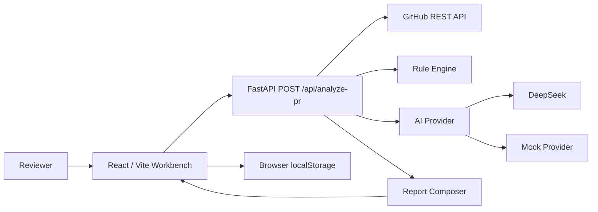

# AI PR Review Assistant Design Notes

## Product Positioning

AI PR Review Assistant is a reviewer aid for public GitHub Pull Requests. The first version focuses on a stable local demo: fetch GitHub PR metadata and changed files, analyze the diff with deterministic rules, optionally enrich the report with DeepSeek, and render a structured result in a React workbench.

The product does not claim to prove that code is safe or correct. Reports use cautious wording such as “possible risks”, “建议确认”, and “建议补充测试” so the output supports human review instead of replacing it.

## System Architecture



The frontend and backend are intentionally separate:

- The frontend owns user interaction, result rendering, Markdown copy, and local recent analyses.
- The backend owns GitHub API calls, diff truncation, rule scanning, AI provider fallback, and final response composition.
- The frontend only consumes the stable `AnalyzePrResponse` contract and does not need to know whether the backend used DeepSeek or Mock mode.

## Backend Flow

The backend exposes two endpoints:

```text
GET  /health
POST /api/analyze-pr
```

The analyze endpoint follows this flow:

```text
AnalyzePrRequest
  -> parse GitHub PR URL
  -> fetch PR metadata
  -> fetch changed files and patch diff
  -> apply MAX_FILES and MAX_PATCH_CHARS truncation
  -> run Rule Engine
  -> run AI Provider
  -> compose final ReviewResult JSON and Markdown Review
  -> return camelCase response
```

The backend returns structured errors through `detail.code` and `detail.message`. Examples include `INVALID_PR_URL`, `GITHUB_NOT_FOUND`, `GITHUB_RATE_LIMITED`, `GITHUB_API_ERROR`, and `AI_PROVIDER_ERROR`.

## Rule Engine Strategy

The first version uses a lightweight `file path + patch diff` strategy. It does not perform AST parsing, type analysis, or cross-file call graph analysis.

Rules focus on deterministic review hints:

- Security: hardcoded secrets, unsafe HTML, unsafe eval, SQL string concatenation.
- Stability: removed error handling, removed null checks, large changes, config changes.
- Tests: missing tests, removed tests.
- Maintainability: complex conditions, unclear TODO or FIXME changes.

The Rule Engine outputs structured `RiskItem` objects with stable IDs, severity, source, title, description, and suggestion. These rule results are passed to the AI Provider and Report Composer, then displayed as “Possible Risks”.

## AI Provider Strategy

The backend has a pluggable AI Provider interface:

```text
AI_PROVIDER=auto
  With DEEPSEEK_API_KEY    -> DeepSeekProvider
  Without DEEPSEEK_API_KEY -> MockProvider

AI_PROVIDER=mock
  Always MockProvider

AI_PROVIDER=deepseek
  Require DEEPSEEK_API_KEY
```

DeepSeek output is treated as an intermediate draft, not the final API response. `report_composer.py` always creates the final `AnalyzePrResponse`, preserving a stable structure for the frontend.

In `auto` mode, provider failures fall back to Mock mode and add warnings such as `AI_TIMEOUT`, `AI_PROVIDER_ERROR`, or `AI_INVALID_JSON`. In forced `deepseek` mode, provider failures return an API error so real model integration issues are visible during debugging.

Mock mode is treated as the default reviewer path, not as a throwaway placeholder. It generates deterministic analysis from real GitHub PR metadata, changed files, patch diff signals, Rule Engine risks, test-file presence, and truncation state. This keeps the demo useful when reviewers do not have a DeepSeek API key.

## Frontend Workbench

The React workbench has three main areas:

- PR URL input and analyze action.
- Result panel with PR metadata, risk level, warnings, summary, changed files, possible risks, suggestions, and Markdown Review preview.
- Recent analyses sidebar backed by browser `localStorage`.

The frontend explicitly renders important reliability states:

- Mock mode warning when no DeepSeek key is configured or auto fallback happens.
- Diff truncation warning when the backend trims large PR input.
- Backend error messages through `detail.message`, while keeping the PR URL editable for retry.

The Markdown Review can be copied with one click. Recent analyses are stored locally in the browser, capped to 10 items, and can be restored without a new API call.

## Data and Persistence Boundary

The first version does not use a database. This is intentional:

- It keeps local setup simple for reviewers.
- It avoids migration and deployment persistence concerns.
- It keeps the core PR analysis flow easy to reproduce.

Only recent analyses are persisted, and only in the browser. Clearing browser storage or switching browsers removes that history.

## Context and Size Controls

The backend limits PR input size with:

```text
MAX_FILES=20
MAX_PATCH_CHARS=30000
REQUEST_TIMEOUT=60
AI_TIMEOUT_SECONDS=30
```

Large PRs are truncated rather than rejected when possible. The response includes `analysis.truncated=true` and a `PATCH_TRUNCATED` warning so users understand that the report is based on a reduced diff.

## Current Limits

- Public GitHub PRs are the primary supported path.
- Private repository auth and installation flows are not implemented.
- The system does not fetch full repository contents.
- The system does not perform AST-level semantic analysis.
- The system does not run asynchronous background jobs.
- Recent analysis history is local to the current browser.

## Future Work

The next version could add:

- Backend persistence for shared analysis history.
- False-positive feedback on individual risk items.
- Private repository support through GitHub OAuth or GitHub App installation.
- Async deep analysis for large PRs.
- Language-specific analyzers for JavaScript, TypeScript, React, and Python.
- More deployment hardening, including health probes, structured logs, and rate-limit dashboards.
